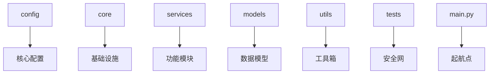

# 🌟 项目结构指南：刷题社交客户端探索之旅  

> *“优秀的项目结构是成功的一半——它能让你在代码丛林中永不迷路”*  

你好呀，勇敢的开发者！👋 这份文档将作为你的探索地图，带你穿越这个项目的每一寸土地。无论你是第一次开发还是经验丰富的冒险家，这里都有你需要的路标！  



## 🗂 目录结构详解  

### 📁 `config/` - **控制中心**  
> *存放所有配置和API定义，就像飞船的控制面板*  

| 文件 | 作用 | 何时修改 |  
|------|------|----------|  
| `settings.py` | 存储API密钥、设备参数等敏感和固定配置 | 1. 更换API密钥<br>2. 调整设备信息<br>3. 修改基础URL |  
| `api_endpoints.py` | 定义所有API的路径、方法和必需参数 | 1. 添加新API<br>2. API路径变更<br>3. 参数要求变化 |  

```python
# 示例：添加新API端点
API_ENDPOINTS = {
    "NEW_FEATURE": {
        "method": "POST",
        "path": "/cool/new_feature",
        "required_params": ["param1", "param2"]
    }
}
```

### 📁 `core/` - **引擎室**  
> *项目的心脏地带，驱动一切的基础系统*  

| 文件 | 作用 | 何时修改 |  
|------|------|----------|  
| `api_client.py` | API请求的总控中心，处理所有网络通信 | 1. 更改请求逻辑<br>2. 添加重试机制<br>3. 修改错误处理 |  
| `param_manager.py` | 智能管理所有API参数 | 1. 参数合并逻辑变化<br>2. 新增动态参数类型<br>3. 响应参数提取规则变更 |  
| `signer.py` | 签名算法的秘密基地 | 1. API签名算法变更<br>2. 更换加密方式 |  

```python
# 签名算法伪代码
def magic_sign(params):
    sorted_params = sort_keys(params)  # 步骤1：排序
    secret_sauce = mix_with_salt(sorted_params)  # 步骤2：加盐
    return cook_md5(secret_sauce)  # 步骤3：MD5烘焙
```

### 📁 `services/` - **功能舱**  
> *实现具体功能的模块，就像飞船的各个舱室*  

| 文件 | 作用 | 何时修改 |  
|------|------|----------|  
| `auth_service.py` | 处理登录/注销等认证操作 | 1. 添加新登录方式<br>2. 修改会话管理 |  
| `user_service.py` | 用户相关功能（个人信息、好友等） | 1. 添加个人资料编辑<br>2. 实现好友系统 |  
| `tiku_service.py` | 刷题核心功能 | 1. 新增题型支持<br>2. 修改答题逻辑 |  
| `paper_service.py` | 试卷管理功能 | 1. 添加试卷筛选<br>2. 实现试卷收藏 |  
| `social_service.py` | 社交功能（动态、消息等） | 1. 添加评论功能<br>2. 实现私信系统 |  

```python
# 在tiku_service中添加新方法示例
def get_daily_challenge(self):
    """获取每日挑战题目"""
    return self.client.request("DAILY_CHALLENGE")
```

### 📁 `models/` - **数据蓝图**  
> *定义数据结构，就像建筑的设计图*  

| 文件 | 作用 | 何时修改 |  
|------|------|----------|  
| `user.py` | 用户模型定义 | 1. 新增用户属性<br>2. 修改数据验证规则 |  
| `question.py` | 题目模型 | 1. 支持新题型<br>2. 添加难度分级 |  
| `paper.py` | 试卷模型 | 1. 添加学科分类<br>2. 扩展元数据 |  
| `social.py` | 社交模型（动态、评论等） | 1. 添加点赞功能<br>2. 支持多媒体动态 |  

```python
# 用户模型示例
class User:
    def __init__(self, uid, nickname, avatar):
        self.uid = uid  # 用户ID
        self.nickname = nickname  # 昵称
        self.avatar = avatar  # 头像URL
        # 添加新属性：self.badge = "萌新"
```

### 📁 `utils/` - **工具箱**  
> *装满实用工具，就像多功能瑞士军刀*  

| 文件 | 作用 | 何时修改 |  
|------|------|----------|  
| `encryption.py` | 加密解密工具 | 1. 密码加密方式变更<br>2. 添加新加密算法 |  
| `logger.py` | 日志系统 | 1. 更改日志格式<br>2. 添加文件日志 |  
| `helpers.py` | 各种辅助函数 | 1. 添加数据处理工具<br>2. 实现通用转换器 |  

```python
# 日志工具示例
def setup_logger():
    logger = logging.getLogger("tiku_app")
    logger.setLevel(logging.DEBUG)  # 调试时用DEBUG，上线后改INFO
```

### 📁 `tests/` - **安全网**  
> *测试堡垒，确保你的代码不会突然坠落*  

| 文件/目录 | 作用 | 何时修改 |  
|-----------|------|----------|  
| `test_api_client.py` | 测试基础API功能 | 1. 添加新API测试<br>2. 修改签名测试 |  
| `test_services/` | 服务功能测试 | 每次添加新功能时 |  

```python
# 测试示例：确保登录成功
def test_login_success():
    client = TestClient()
    assert client.login("test", "pass") == True
```

### 📄 根目录文件 - **指挥中心**  

| 文件 | 作用 | 何时修改 |  
|------|------|----------|  
| `main.py` | 程序启动入口 | 1. 更改启动流程<br>2. 添加全局异常处理 |  
| `.env` | 存储环境变量（千万别提交！） | 更换API密钥或敏感信息时 |  
| `requirements.txt` | 项目依赖清单 | 添加/删除依赖库时 |  

## 🧭 开发路线图：什么时候该去哪里？

### 🚀 任务1：添加新API功能
1. **`config/api_endpoints.py`** - 定义新API端点
2. **`services/对应_service.py`** - 实现功能方法
3. **`tests/test_services/`** - 添加测试用例

### 🔧 任务2：修改签名算法
1. **`core/signer.py`** - 修改签名逻辑
2. **`tests/test_api_client.py`** - 更新签名测试

### 🎨 任务3：扩展用户功能
1. **`models/user.py`** - 添加新字段
2. **`services/user_service.py`** - 实现相关方法
3. **`tests/test_services/test_user.py`** - 添加测试

### 🐞 任务4：调试API问题
1. **`core/api_client.py`** - 添加调试日志
2. **`utils/logger.py`** - 调整日志级别为DEBUG
3. **`services/相关_service.py`** - 检查参数传递

## 💌 来自代码宇宙的明信片

> 给**探险家**的你：  
> 当你在参数森林中迷路时，记住每个伟大的开发者都曾是初学者。那些看似复杂的API，不过是被拆解的积木！

> 给**完美主义者**的你：  
> 不要试图一次建好整座城堡！先搭个帐篷（MVP），再慢慢砌墙。`git commit`是你的时光机，随时可以回到过去。

> 给**疲惫的战士**的你：  
> 当BUG如潮水般涌来，深呼吸，喝杯茶。记住：  
> ```python
> while not problem_solved:
>     try_again()
>     take_break()  # 这是最重要的步骤！
> ```

> 给**未来的你**：  
> 当这个项目完成时，回望这些文件——它们不只是代码，而是你成长的星图。每个`import`都是你跨越的星系，每个`function`都是你建立的太空站！

## 🌈 最后的小魔法

在项目根目录创建`.env`文件，添加你的魔法咒语（API密钥）：
```
# .env 文件（你的秘密花园）
API_KEY=your_magic_key_here
APP_ID=your_app_id_here
```

然后运行：  
```bash
python main.py --launch
```

你的星际飞船即将起飞！记得：**每个错误不是终点，而是新轨道的起点**。快乐编码，太空牛仔！🚀💻✨

> 文档最后更新：2025-07-11 22:53 
> 由你忠实的AI助手在代码宇宙中编写 ✨